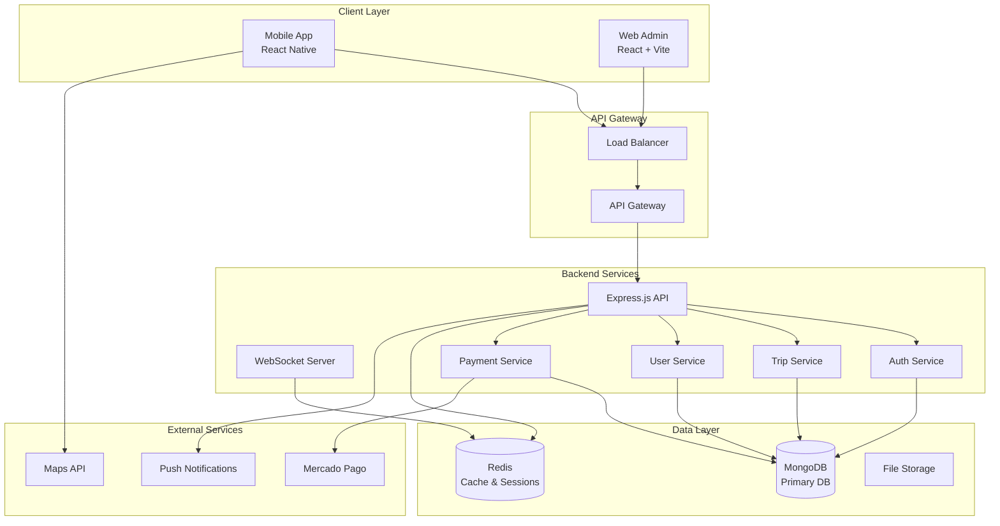
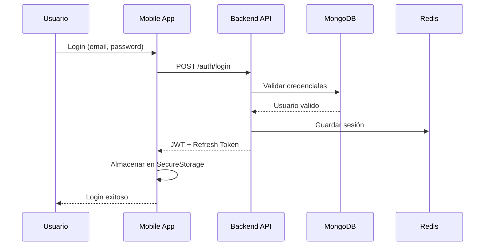
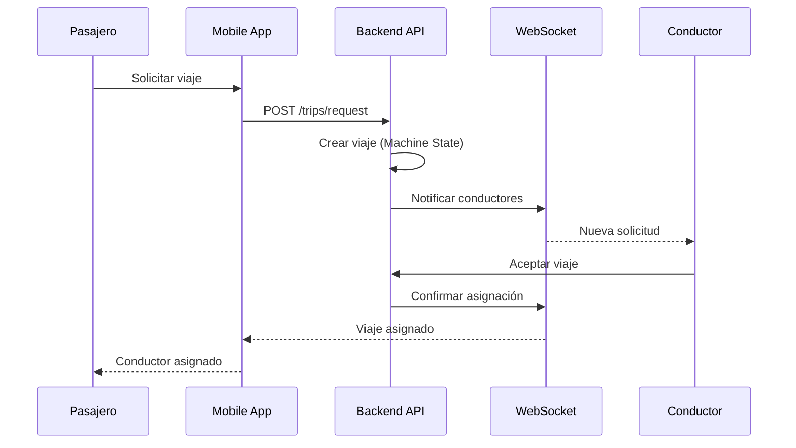

# 🏗️ Arquitectura de GoTaxi

## 📋 Tabla de Contenidos

- [Visión General](#-visión-general)
- [Arquitectura del Sistema](#-arquitectura-del-sistema)
- [Backend (go-taxi-backend)](#-backend-go-taxi-backend)
- [Frontend Mobile (GoTaxiPassengerApp)](#-frontend-mobile-gotaxipassengerapp)
- [Panel Admin (go-taxi-admin-web)](#-panel-admin-go-taxi-admin-web)
- [Patrones de Diseño](#-patrones-de-diseño)
- [Flujos de Datos](#-flujos-de-datos)
- [Seguridad](#-seguridad)
- [Rendimiento](#-rendimiento)
- [Escalabilidad](#-escalabilidad)

## 🎯 Visión General

GoTaxi es una plataforma de transporte urbano construida con una arquitectura moderna, escalable y segura. El sistema está compuesto por tres aplicaciones principales:

1. **Backend API** - Servidor Node.js con arquitectura hexagonal
2. **Aplicación Móvil** - React Native con Expo para pasajeros
3. **Panel de Administración** - React con Vite para administradores

## 🏛️ Arquitectura del Sistema



## 🔧 Backend (go-taxi-backend)

### Arquitectura Hexagonal

El backend implementa **Arquitectura Hexagonal** (Ports & Adapters) para lograr:

- **Separación clara** entre lógica de negocio y detalles de implementación
- **Testabilidad** mejorada con mocks y stubs
- **Flexibilidad** para cambiar tecnologías sin afectar el core
- **Mantenibilidad** con responsabilidades bien definidas

### Estructura de Directorios

```
src/
├── api/                    # Capa de Presentación
│   ├── controllers/        # Controladores REST
│   ├── routes/            # Definición de rutas
│   └── dtos/              # Data Transfer Objects
├── business/              # Capa de Aplicación (Core)
│   ├── AuthService.js     # Servicio de autenticación
│   └── TripService.js     # Servicio de viajes
├── domain/                # Capa de Dominio
│   └── entities/          # Entidades de negocio
├── repositories/          # Capa de Infraestructura
│   ├── UserRepository.js  # Repositorio de usuarios
│   └── TripRepository.js  # Repositorio de viajes
├── services/              # Servicios externos
│   ├── cacheService.js    # Servicio de caché
│   └── mailService.js     # Servicio de email
├── middlewares/           # Middlewares de Express
├── config/                # Configuración
└── utils/                 # Utilidades
```

### Patrones Implementados

#### 1. Repository Pattern

```javascript
class UserRepository {
  async findById(id) {
    // Implementación específica de MongoDB
  }

  async create(userData) {
    // Lógica de persistencia
  }
}
```

#### 2. Service Layer

```javascript
class AuthService {
  constructor(userRepository) {
    this.userRepository = userRepository;
  }

  async login(email, password) {
    // Lógica de negocio pura
  }
}
```

#### 3. Machine State (TripService)

```javascript
const TRIP_STATES = {
  REQUESTED: "requested",
  ASSIGNED: "assigned",
  IN_PROGRESS: "in_progress",
  COMPLETED: "completed",
  CANCELLED: "cancelled",
};

const VALID_TRANSITIONS = {
  [TRIP_STATES.REQUESTED]: [TRIP_STATES.ASSIGNED, TRIP_STATES.CANCELLED],
  [TRIP_STATES.ASSIGNED]: [TRIP_STATES.IN_PROGRESS, TRIP_STATES.CANCELLED],
  // ...
};
```

### Optimizaciones de Base de Datos

#### Índices Compuestos

```javascript
// Usuarios por email y estado
{ email: 1, isActive: 1 }

// Viajes por pasajero y fecha
{ passengerId: 1, createdAt: -1 }

// Viajes por conductor y estado
{ driverId: 1, status: 1, createdAt: -1 }
```

#### Agregaciones Optimizadas

```javascript
async getTripStats(filters = {}) {
  return await Trip.aggregate([
    { $match: filters },
    { $group: {
      _id: '$status',
      count: { $sum: 1 },
      totalFare: { $sum: '$fare' }
    }}
  ]);
}
```

### Caché Distribuido

#### Estrategias de Invalidación

```javascript
const CACHE_PREFIXES = {
  USER: "user",
  TRIP: "trip",
  DRIVER: "driver",
  STATS: "stats",
};

const TTL_CONFIG = {
  [CACHE_PREFIXES.USER]: 3600, // 1 hora
  [CACHE_PREFIXES.TRIP]: 1800, // 30 minutos
  [CACHE_PREFIXES.STATS]: 300, // 5 minutos
};
```

## 📱 Frontend Mobile (GoTaxiPassengerApp)

### Arquitectura de Componentes

```
src/
├── components/            # Componentes reutilizables
│   ├── common/           # Componentes base
│   ├── auth/             # Componentes de autenticación
│   ├── booking/          # Componentes de reservas
│   └── map/              # Componentes de mapas
├── screens/              # Pantallas de la aplicación
├── contexts/             # Context API para estado global
├── hooks/                # Hooks personalizados
├── services/             # Servicios de negocio
├── infrastructure/       # Repositorios y APIs
├── domain/               # Entidades de dominio
└── utils/                # Utilidades y helpers
```

### Gestión de Estado

#### Context API Optimizado

```javascript
// Context con selectores para evitar re-renders
export const AuthContext = createContext();

export const AuthProvider = ({ children }) => {
  const [state, setState] = useState(initialState);

  const value = useMemo(
    () => ({
      ...state,
      actions: {
        login: useCallback(login, []),
        logout: useCallback(logout, []),
      },
    }),
    [state]
  );

  return <AuthContext.Provider value={value}>{children}</AuthContext.Provider>;
};
```

#### Selectores Específicos

```javascript
// Hook para suscripción granular
export const useAuthUser = () =>
  useContextSelector(AuthContext, (state) => state.user);

export const useAuthLoading = () =>
  useContextSelector(AuthContext, (state) => state.loading);
```

### Optimizaciones de Rendimiento

#### React.memo y useCallback

```javascript
const TripItem = memo(function TripItem({ trip }) {
  const handleExpand = useCallback(() => {
    // Lógica de expansión
  }, []);

  const formattedDate = useMemo(
    () => formatDate(trip.createdAt),
    [trip.createdAt]
  );

  return <View>{/* Componente optimizado */}</View>;
});
```

#### Lazy Loading

```javascript
const LazyScreen = ({ screenName, ...props }) => {
  const [Component, setComponent] = useState(null);

  useEffect(() => {
    const loadComponent = async () => {
      const { default: ScreenComponent } = await import(
        `../screens/${screenName}`
      );
      setComponent(() => ScreenComponent);
    };

    loadComponent();
  }, [screenName]);

  return Component ? <Component {...props} /> : <LoadingScreen />;
};
```

### Almacenamiento Seguro

#### Encriptación AES-256-CBC

```javascript
class SecureStorage {
  encrypt(data) {
    const iv = this.generateIV();
    const cipher = crypto.createCipher("aes-256-cbc", this.getEncryptionKey());
    let encrypted = cipher.update(JSON.stringify(data), "utf8", "hex");
    encrypted += cipher.final("hex");

    // Incluir IV y checksum para integridad
    return `${iv}:${encrypted}:${this.generateChecksum(encrypted)}`;
  }
}
```

#### Rotación Automática de Claves

```javascript
async rotateKey() {
  const oldKey = this.getEncryptionKey();
  const newKey = this.generateNewKey();

  // Migrar datos existentes
  await this.migrateDataWithNewKey(oldKey, newKey);

  // Actualizar configuración
  this.updateKey(newKey);
}
```

## 🖥️ Panel Admin (go-taxi-admin-web)

### Arquitectura de Componentes

```
src/
├── components/            # Componentes reutilizables
│   ├── Dashboard/        # Componentes del dashboard
│   ├── Drivers/          # Gestión de conductores
│   ├── Passengers/       # Gestión de pasajeros
│   └── ui/               # Componentes base
├── pages/                # Páginas principales
├── api/                  # Cliente API
├── contexts/             # Context API
└── hooks/                # Hooks personalizados
```

## 🔄 Patrones de Diseño

### 1. Observer Pattern

- **WebSockets** para notificaciones en tiempo real
- **Context API** para actualizaciones de estado

### 2. Strategy Pattern

- **Métodos de pago** (efectivo, Mercado Pago, tarjeta)
- **Estrategias de caché** (TTL, invalidación)

### 3. Factory Pattern

- **Creación de entidades** (User, Trip, Driver)
- **Generación de respuestas** API estandarizadas

### 4. Command Pattern

- **Operaciones offline** con cola de sincronización
- **Retry logic** para operaciones fallidas

## 📊 Flujos de Datos

### Flujo de Autenticación



### Flujo de Solicitud de Viaje



## 🔒 Seguridad

### Capas de Seguridad

#### 1. Autenticación

- **JWT** con expiración corta (15 minutos)
- **Refresh Tokens** con expiración larga (7 días)
- **Rotación automática** de tokens

#### 2. Autorización

- **Middleware de autenticación** en todas las rutas protegidas
- **Validación de roles** (pasajero, conductor, admin)
- **Permisos granulares** por recurso

#### 3. Validación de Datos

- **Sanitización XSS** en todos los inputs
- **Validación de esquemas** con Joi
- **Content Security Policy** configurable

#### 4. Rate Limiting

- **Límites por IP** para prevenir ataques
- **Límites por usuario** para abuso
- **Límites por endpoint** específicos

### Almacenamiento Seguro

#### Encriptación

- **AES-256-CBC** para datos sensibles
- **IV único** por cada encriptación
- **Checksum SHA256** para integridad
- **Rotación automática** de claves

#### Protección XSS

```javascript
// Sanitización de datos
const sanitizedData = sanitizeFormData(formData);

// Detección de patrones maliciosos
const xssDetection = detectXSS(JSON.stringify(data));
if (xssDetection.riskLevel === "HIGH") {
  throw new Error("Datos potencialmente maliciosos detectados");
}
```

## ⚡ Rendimiento

### Optimizaciones Backend

#### 1. Caché Inteligente

- **TTL dinámico** según el tipo de dato
- **Invalidación por patrones** para consistencia
- **Métricas de caché** para monitoreo

#### 2. Consultas Optimizadas

- **Índices compuestos** para consultas frecuentes
- **Agregaciones MongoDB** para estadísticas
- **Paginación cursor-based** para grandes datasets

#### 3. Connection Pooling

- **Pool de conexiones** MongoDB optimizado
- **Reutilización de conexiones** para eficiencia
- **Monitoreo de conexiones** activas

### Optimizaciones Frontend

#### 1. Code Splitting

- **Lazy loading** de pantallas
- **Chunks optimizados** por ruta
- **Preloading** de componentes críticos

#### 2. Memoización

- **React.memo** para componentes puros
- **useCallback** para funciones estables
- **useMemo** para cálculos costosos

#### 3. Context Selectors

- **Suscripción granular** al estado
- **Prevención de re-renders** innecesarios
- **Selectores derivados** para datos computados

## 📈 Escalabilidad

### Horizontal Scaling

#### Backend

- **Load Balancer** para distribución de carga
- **Múltiples instancias** de la API
- **Redis Cluster** para caché distribuido
- **MongoDB Replica Set** para alta disponibilidad

#### Frontend

- **CDN** para assets estáticos
- **Service Workers** para caché offline
- **Progressive Web App** (PWA) capabilities

### Vertical Scaling

#### Optimizaciones de Memoria

- **Garbage Collection** optimizado
- **Memory leaks** detection
- **Resource pooling** para eficiencia

#### Optimizaciones de CPU

- **Async/await** para operaciones no bloqueantes
- **Worker threads** para tareas pesadas
- **Clustering** para aprovechar múltiples cores

## 🔧 Monitoreo y Observabilidad

### Métricas de Aplicación

- **Request/Response times**
- **Error rates** por endpoint
- **Database query performance**
- **Cache hit/miss ratios**

### Logging Estructurado

```javascript
logger.info("User login successful", {
  userId: user.id,
  email: user.email,
  timestamp: new Date().toISOString(),
  userAgent: req.get("User-Agent"),
  ip: req.ip,
});
```

### Health Checks

- **Database connectivity**
- **Redis availability**
- **External services status**
- **Memory usage**
- **CPU utilization**

---

<div align="center">
  <p>📚 Esta documentación se actualiza continuamente con las mejoras implementadas</p>
  <p>🔄 Última actualización: Diciembre 2024</p>
</div>
